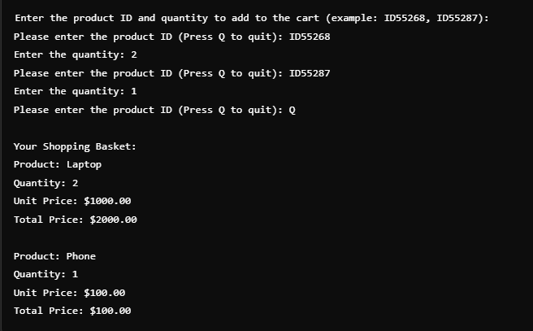

# Shopping Cart Application

This is a simple Java-based console application that simulates a basic e-commerce shopping cart system. It allows users to select products, choose a shipping method, and complete payment through a text-based interface.

---

## Features

### 🛍️ Product Management
- Products are predefined with unique IDs, names, prices, weights, and stock quantities.
- Users can add products to the shopping basket by entering the product ID and quantity.

### 🚚 Shipping Options
- Users can choose between **Standard Shipment**, **Express Shipment**, and **Special Shipment**.
- Shipping costs are calculated based on total weight using different multipliers.

### 💳 Payment Options
- Two payment methods are available:
  - **Credit Card Payment**: Enter card number to process payment.
  - **EFT/Transfer Payment**: Enter IBAN number to complete payment.
- The total cost includes the basket total and shipping cost.

---

## Technologies Used

- **Java**
- Object-Oriented Programming concepts: `abstract classes`, `interfaces`, and `inheritance`

---

## How to Run

1. **Compile the Code**  
   Make sure you have JDK installed. Use the following command to compile:
   ```bash
   javac Main.java
   ```

2. **Run the Program**  
   Execute the program using:
   ```bash
   java Main
   ```

3. **Follow the Instructions**  
   - Enter product IDs and quantities to add items to the cart.
   - Choose a shipping method.
   - Choose a payment method to complete the purchase.

---

## Example Run



```text
Enter the product ID and quantity to add to the cart (example: ID55268, ID55287):
Please enter the product ID (Press Q to quit): ID55268
Enter the quantity: 2
Please enter the product ID (Press Q to quit): ID55287
Enter the quantity: 1
Please enter the product ID (Press Q to quit): Q

Your Shopping Basket:
Product: Laptop
Quantity: 2
Unit Price: $1000.00
Total Price: $2000.00

Product: Phone
Quantity: 1
Unit Price: $100.00
Total Price: $100.00
```

---

## Classes Overview

### 1. `Product`
Represents a product with:
- `id`: Unique product ID.
- `name`: Product name.
- `price`: Product price.
- `stock`: Available stock quantity.
- `weight`: For calculating shipping cost.

### 2. `ShoppingBasket`
Handles:
- Adding products to the basket.
- Calculating the total price of items.

### 3. `Payment` (Abstract Class)
Base class for payment methods. Derived classes:
- **`CreditCardPayment`**: Handles payments via credit card.
- **`EFTPayment`**: Handles payments via EFT/Transfer.

### 4. `ShipmentMethod` (Interface)
Defines a method for calculating shipping costs. Implementations:
- **`StandardShipment`**: Shipping cost = weight × 1.0
- **`ExpressShipment`**: Shipping cost = weight × 1.5
- **`SpecialShipment` : Shipping cost = weight × 2.0

---

## Future Enhancements

- Add more products dynamically from the user.
- Implement persistent storage for products and transactions.
- Add user authentication for secure payments.

---

## My Contributions

This was a collaborative project, and my personal contributions included:

- Designing and implementing the `Product` class structure.
- Developing the abstract `Payment` system and its subclasses (`CreditCardPayment`, `EFTPayment`).
- Creating the `Main.java` file, which handles program execution and user interaction flow.

---

## Authors

- Özlem EKER  
- Elif YURTTAKALAN
